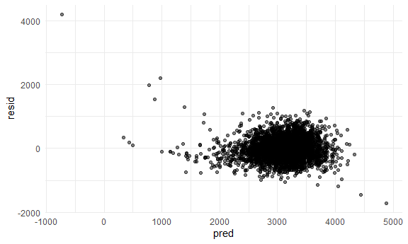
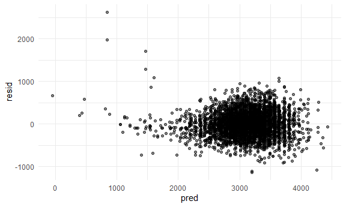
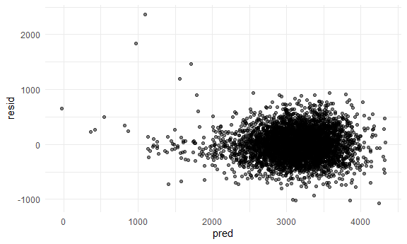

P8105 Homework 6
================
sarah\_8105

This is my sixth homework assignment for P8105.

``` r
library(tidyverse)
```

    ## -- Attaching packages ----------------------------------------------------- tidyverse 1.3.0 --

    ## v ggplot2 3.3.2     v purrr   0.3.4
    ## v tibble  3.0.4     v dplyr   1.0.2
    ## v tidyr   1.1.2     v stringr 1.4.0
    ## v readr   1.3.1     v forcats 0.5.0

    ## Warning: package 'tibble' was built under R version 4.0.3

    ## Warning: package 'purrr' was built under R version 4.0.3

    ## -- Conflicts -------------------------------------------------------- tidyverse_conflicts() --
    ## x dplyr::filter() masks stats::filter()
    ## x dplyr::lag()    masks stats::lag()

``` r
library(rvest)
```

    ## Loading required package: xml2

    ## 
    ## Attaching package: 'rvest'

    ## The following object is masked from 'package:purrr':
    ## 
    ##     pluck

    ## The following object is masked from 'package:readr':
    ## 
    ##     guess_encoding

``` r
library(readr)
library(httr)
```

    ## Warning: package 'httr' was built under R version 4.0.3

``` r
knitr::opts_chunk$set(
  fig.width = 6,
  fig.asp = .6,
  out.width = "90%"
)

theme_set(theme_minimal() + theme(legend.position = "bottom"))

options(
  ggplot2.continuous.colour = "viridis",
  ggplot2.continuous.fill = "viridis"
)

scale_colour_discrete = scale_colour_viridis_d
scale_fill_discrete = scale_fill_viridis_d
```

## Problem 1

In this first code chunk, I pull the Washington Post data on homicides
in 50 large US cities. I create a `city_state` variable that
concatenates the city and state that the homicide occurred in and remove
an observation that was erroneously attributed to Tulsa, AL.

``` r
homicide_df = read_csv(file = "https://raw.githubusercontent.com/washingtonpost/data-homicides/master/homicide-data.csv") %>%
  mutate(
    city_state = str_c(city, state, sep = "_")
  ) %>%
  select(city_state, disposition) %>%
  filter(city_state != "Tulsa_AL")
```

    ## Parsed with column specification:
    ## cols(
    ##   uid = col_character(),
    ##   reported_date = col_double(),
    ##   victim_last = col_character(),
    ##   victim_first = col_character(),
    ##   victim_race = col_character(),
    ##   victim_age = col_character(),
    ##   victim_sex = col_character(),
    ##   city = col_character(),
    ##   state = col_character(),
    ##   lat = col_double(),
    ##   lon = col_double(),
    ##   disposition = col_character()
    ## )

## Problem 2

Problem 2 focuses on understanding the effects of different variables on
low birth weight. The data set consists of \~4000 children and factors
related to their birth and their parents. In this first code chunk, I
import and explore the data to assess distributions and missingness.

``` r
bwt_df = 
  read_csv("Data/birthweight.csv") %>%
  janitor::clean_names() %>%
  mutate(
    babysex = as_factor(babysex),
    frace = as_factor(frace),
    malform = as_factor(malform),
    mrace = as_factor(mrace),
    smoking_status = as_factor(if_else(smoken == 0, 0, 1)),
    menarche = if_else(menarche == 0, NA_real_, menarche)
  )  %>%
  select(-pnumlbw, -pnumsga)
```

    ## Parsed with column specification:
    ## cols(
    ##   .default = col_double()
    ## )

    ## See spec(...) for full column specifications.

``` r
summary(bwt_df)
```

    ##  babysex      bhead          blength           bwt           delwt      
    ##  1:2230   Min.   :21.00   Min.   :20.00   Min.   : 595   Min.   : 86.0  
    ##  2:2112   1st Qu.:33.00   1st Qu.:48.00   1st Qu.:2807   1st Qu.:131.0  
    ##           Median :34.00   Median :50.00   Median :3132   Median :143.0  
    ##           Mean   :33.65   Mean   :49.75   Mean   :3114   Mean   :145.6  
    ##           3rd Qu.:35.00   3rd Qu.:51.00   3rd Qu.:3459   3rd Qu.:157.0  
    ##           Max.   :41.00   Max.   :63.00   Max.   :4791   Max.   :334.0  
    ##                                                                         
    ##     fincome      frace       gaweeks      malform     menarche    
    ##  Min.   : 0.00   1:2123   Min.   :17.70   0:4327   Min.   : 5.00  
    ##  1st Qu.:25.00   2:1911   1st Qu.:38.30   1:  15   1st Qu.:12.00  
    ##  Median :35.00   3:  46   Median :39.90            Median :12.00  
    ##  Mean   :44.11   4: 248   Mean   :39.43            Mean   :12.52  
    ##  3rd Qu.:65.00   8:  14   3rd Qu.:41.10            3rd Qu.:13.00  
    ##  Max.   :96.00            Max.   :51.30            Max.   :19.00  
    ##                                                    NA's   :1      
    ##     mheight          momage     mrace        parity             ppbmi      
    ##  Min.   :48.00   Min.   :12.0   1:2147   Min.   :0.000000   Min.   :13.07  
    ##  1st Qu.:62.00   1st Qu.:18.0   2:1909   1st Qu.:0.000000   1st Qu.:19.53  
    ##  Median :63.00   Median :20.0   3:  43   Median :0.000000   Median :21.03  
    ##  Mean   :63.49   Mean   :20.3   4: 243   Mean   :0.002303   Mean   :21.57  
    ##  3rd Qu.:65.00   3rd Qu.:22.0            3rd Qu.:0.000000   3rd Qu.:22.91  
    ##  Max.   :77.00   Max.   :44.0            Max.   :6.000000   Max.   :46.10  
    ##                                                                            
    ##       ppwt           smoken           wtgain       smoking_status
    ##  Min.   : 70.0   Min.   : 0.000   Min.   :-46.00   0:2552        
    ##  1st Qu.:110.0   1st Qu.: 0.000   1st Qu.: 15.00   1:1790        
    ##  Median :120.0   Median : 0.000   Median : 22.00                 
    ##  Mean   :123.5   Mean   : 4.145   Mean   : 22.08                 
    ##  3rd Qu.:134.0   3rd Qu.: 5.000   3rd Qu.: 28.00                 
    ##  Max.   :287.0   Max.   :60.000   Max.   : 89.00                 
    ## 

There appears to be no missing data in this data set, but it’s possible
that some of the zeros represent missing data. For example, an age of
menarchy of 0 is likely missing or erroneous and was therefore set to
missing. However, some zeros are likely to be valid entries. For
example, an average number of cigarettes smoked of 0 likely indicates
that the mother was not a smoker. This variable was converted into a
categorical smoking status variable of smoker vs. non-smoker. The number
of prior low birth weight or small for gestational age babies is 0 for
all subjects, so these variables will be uninformative for our models
and were dropped from the data set.

In the next code chunk I compare three models: \* Model 1: main effects
of length at birth and gestational age only \* Model 2: including
predictors of head circumference, length, sex, and all interactions
between these variables \* Model 3: predictors in model 1 & 2, in
addition to factors that have been demonstrated as significant
predictors of low birth weight in the literature, including mother’s
race, baby’s sex, smoking status, weight gain, and mother’s
pre-pregnancy BMI

``` r
model1 = lm(bwt ~ blength + gaweeks, data = bwt_df)
broom::glance(model1)
```

    ## # A tibble: 1 x 12
    ##   r.squared adj.r.squared sigma statistic p.value    df  logLik    AIC    BIC
    ##       <dbl>         <dbl> <dbl>     <dbl>   <dbl> <dbl>   <dbl>  <dbl>  <dbl>
    ## 1     0.577         0.577  333.     2958.       0     2 -31381. 62771. 62796.
    ## # ... with 3 more variables: deviance <dbl>, df.residual <int>, nobs <int>

``` r
broom::tidy(model1)
```

    ## # A tibble: 3 x 5
    ##   term        estimate std.error statistic  p.value
    ##   <chr>          <dbl>     <dbl>     <dbl>    <dbl>
    ## 1 (Intercept)  -4348.      98.0      -44.4 0.      
    ## 2 blength        129.       1.99      64.6 0.      
    ## 3 gaweeks         27.0      1.72      15.7 2.36e-54

``` r
bwt_df %>%
  modelr::add_predictions(model1) %>%
  modelr::add_residuals(model1) %>%
  ggplot(aes(x = pred, y = resid)) +
    geom_point(alpha = .5)
```



``` r
model2 = lm(bwt ~ bhead + blength + babysex + babysex*bhead*blength, data = bwt_df)
broom::glance(model2)
```

    ## # A tibble: 1 x 12
    ##   r.squared adj.r.squared sigma statistic p.value    df  logLik    AIC    BIC
    ##       <dbl>         <dbl> <dbl>     <dbl>   <dbl> <dbl>   <dbl>  <dbl>  <dbl>
    ## 1     0.685         0.684  288.     1346.       0     7 -30742. 61501. 61559.
    ## # ... with 3 more variables: deviance <dbl>, df.residual <int>, nobs <int>

``` r
broom::tidy(model2)
```

    ## # A tibble: 8 x 5
    ##   term                    estimate std.error statistic      p.value
    ##   <chr>                      <dbl>     <dbl>     <dbl>        <dbl>
    ## 1 (Intercept)            -7177.     1265.       -5.67  0.0000000149
    ## 2 bhead                    182.       38.1       4.78  0.00000184  
    ## 3 blength                  102.       26.2       3.90  0.0000992   
    ## 4 babysex2                6375.     1678.        3.80  0.000147    
    ## 5 bhead:babysex2          -198.       51.1      -3.88  0.000105    
    ## 6 blength:babysex2        -124.       35.1      -3.52  0.000429    
    ## 7 bhead:blength             -0.554     0.780    -0.710 0.478       
    ## 8 bhead:blength:babysex2     3.88      1.06      3.67  0.000245

``` r
bwt_df %>%
  modelr::add_predictions(model2) %>%
  modelr::add_residuals(model2) %>%
  ggplot(aes(x = pred, y = resid)) +
    geom_point(alpha = .5)
```



``` r
model3 = lm(bwt ~ blength + gaweeks + bhead + blength + babysex + babysex*bhead*blength + mrace + babysex + smoken + momage + ppbmi + wtgain, data = bwt_df)
broom::glance(model3)
```

    ## # A tibble: 1 x 12
    ##   r.squared adj.r.squared sigma statistic p.value    df  logLik    AIC    BIC
    ##       <dbl>         <dbl> <dbl>     <dbl>   <dbl> <dbl>   <dbl>  <dbl>  <dbl>
    ## 1     0.715         0.715  274.      725.       0    15 -30520. 61073. 61182.
    ## # ... with 3 more variables: deviance <dbl>, df.residual <int>, nobs <int>

``` r
broom::tidy(model3)
```

    ## # A tibble: 16 x 5
    ##    term                    estimate std.error statistic  p.value
    ##    <chr>                      <dbl>     <dbl>     <dbl>    <dbl>
    ##  1 (Intercept)            -6392.     1212.       -5.27  1.40e- 7
    ##  2 blength                   85.2      25.2       3.38  7.23e- 4
    ##  3 gaweeks                   11.5       1.48      7.75  1.16e-14
    ##  4 bhead                    151.       36.6       4.12  3.86e- 5
    ##  5 babysex2                5424.     1598.        3.39  6.95e- 4
    ##  6 mrace2                  -140.        9.81    -14.3   3.54e-45
    ##  7 mrace3                  -103.       42.7      -2.42  1.57e- 2
    ##  8 mrace4                  -133.       18.8      -7.04  2.20e-12
    ##  9 smoken                    -4.51      0.588    -7.66  2.22e-14
    ## 10 momage                     2.00      1.17      1.71  8.72e- 2
    ## 11 ppbmi                      6.64      1.34      4.95  7.78e- 7
    ## 12 wtgain                     4.14      0.396    10.5   2.34e-25
    ## 13 bhead:babysex2          -167.       48.7      -3.43  6.09e- 4
    ## 14 blength:babysex2        -106.       33.4      -3.17  1.53e- 3
    ## 15 blength:bhead             -0.276     0.749    -0.369 7.12e- 1
    ## 16 blength:bhead:babysex2     3.28      1.01      3.26  1.11e- 3

``` r
bwt_df %>%
  modelr::add_predictions(model3) %>%
  modelr::add_residuals(model3) %>%
  ggplot(aes(x = pred, y = resid)) +
    geom_point(alpha = .5)
```



## Problem 3

In this problem, I use 2017 Central Park weather data. First, I import
the data using the P8105 code.

``` r
weather_df = 
  rnoaa::meteo_pull_monitors(
    c("USW00094728"),
    var = c("PRCP", "TMIN", "TMAX"), 
    date_min = "2017-01-01",
    date_max = "2017-12-31") %>%
  mutate(
    name = recode(id, USW00094728 = "CentralPark_NY"),
    tmin = tmin / 10,
    tmax = tmax / 10) %>%
  select(name, id, everything())
```

    ## Registered S3 method overwritten by 'hoardr':
    ##   method           from
    ##   print.cache_info httr

    ## using cached file: C:\Users\scond\AppData\Local\Cache/R/noaa_ghcnd/USW00094728.dly

    ## date created (size, mb): 2020-11-21 15:33:25 (7.547)

    ## file min/max dates: 1869-01-01 / 2020-11-30

Next, I run a simple linear regression of tmax on tmin using 5000
bootstrap samples. I also calculate log(β<sup>0∗β</sup>1) for each
regression output, plot the distribution of this estimate for all 5000
samples, and calculate the mean and 95% confidence interval.

``` r
boot_strap_results = 
  weather_df %>%
  modelr::bootstrap(n = 5000) %>%
  mutate(
    models = map(strap, ~lm(tmax ~ tmin, data = .x) ),
    results = map(models, broom::tidy),
    r2 = map(models, broom::glance)) %>%
  select(-strap, -models) 

terms = 
  boot_strap_results %>%
  unnest(results) %>%
  select(.id, term, estimate) %>%
  pivot_wider(
    names_from = "term",
    values_from = "estimate"
  ) %>%
  janitor::clean_names() %>%
  mutate(
    estimate = log(intercept * tmin)
  ) 


terms %>%
  ggplot(aes(x = estimate)) + 
  geom_density()
```


``` r
terms %>%
  summarize(
    avg = mean(estimate),
    lcl = quantile(estimate, 0.025),
    ucl = quantile(estimate, 0.975)
    ) %>% 
  knitr::kable(digits = 2)
```

|  avg |  lcl |  ucl |
| ---: | ---: | ---: |
| 2.01 | 1.97 | 2.06 |

In this last code chunk, I plot the distribution of the R^2 for all 5000
samples and calculate the mean and 95% confidence interval.

``` r
r2 = 
  boot_strap_results %>%
  unnest(r2) 


r2 %>%
  ggplot(aes(x = r.squared)) +
  geom_density()
```


``` r
r2 %>%
  summarize(
    avg = mean(r.squared),
    lcl = quantile(r.squared, 0.025),
    ucl = quantile(r.squared, 0.975)
    ) %>% 
  knitr::kable(digits = 3)
```

|   avg |   lcl |   ucl |
| ----: | ----: | ----: |
| 0.912 | 0.894 | 0.928 |
