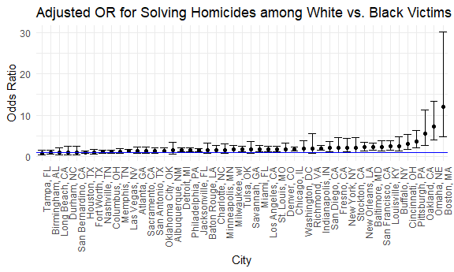
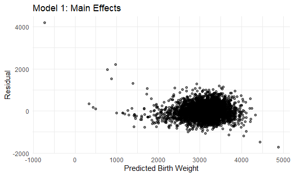
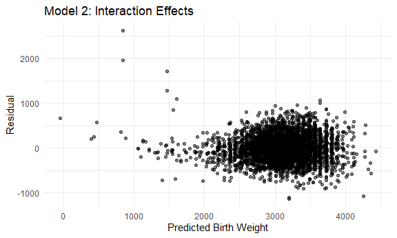
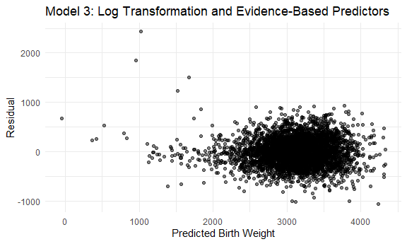
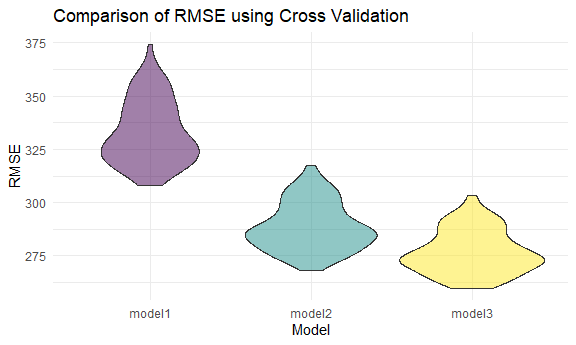
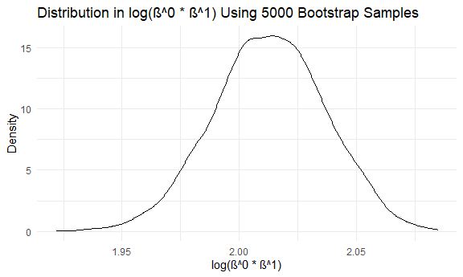
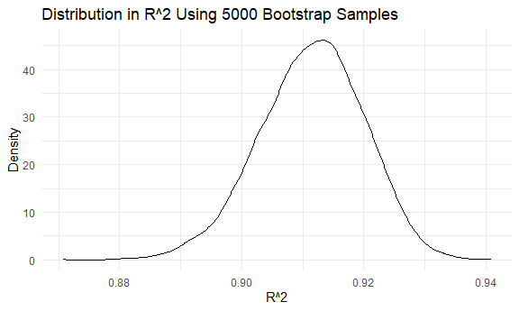

P8105 Homework 6
================
sarah\_8105

This is my sixth homework assignment for P8105.

``` r
library(tidyverse)
```

    ## -- Attaching packages --------------------------------------------------------------------------------------------------------------- tidyverse 1.3.0 --

    ## v ggplot2 3.3.2     v purrr   0.3.4
    ## v tibble  3.0.4     v dplyr   1.0.2
    ## v tidyr   1.1.2     v stringr 1.4.0
    ## v readr   1.3.1     v forcats 0.5.0

    ## Warning: package 'tibble' was built under R version 4.0.3

    ## Warning: package 'purrr' was built under R version 4.0.3

    ## -- Conflicts ------------------------------------------------------------------------------------------------------------------ tidyverse_conflicts() --
    ## x dplyr::filter() masks stats::filter()
    ## x dplyr::lag()    masks stats::lag()

``` r
library(rvest)
```

    ## Loading required package: xml2

    ## 
    ## Attaching package: 'rvest'

    ## The following object is masked from 'package:purrr':
    ## 
    ##     pluck

    ## The following object is masked from 'package:readr':
    ## 
    ##     guess_encoding

``` r
library(readr)
library(httr)
```

    ## Warning: package 'httr' was built under R version 4.0.3

``` r
library(modelr)

knitr::opts_chunk$set(
  fig.width = 6,
  fig.asp = .6,
  out.width = "90%"
)

theme_set(theme_minimal() + theme(legend.position = "bottom"))

options(
  ggplot2.continuous.colour = "viridis",
  ggplot2.continuous.fill = "viridis"
)

scale_colour_discrete = scale_colour_viridis_d
scale_fill_discrete = scale_fill_viridis_d
```

## Problem 1

In this first code chunk, I pull the Washington Post data on homicides
in 50 large US cities. I create a `city_state` variable that
concatenates the city and state that the homicide occurred in and remove
an observation that was erroneously attributed to Tulsa, AL. I also
create a resolution variable to classify homicides that were closed by
arrest versus those that had no arrest and filter to homicides with
white or black victims due to low numbers among other race/ethnicities.

``` r
homicide_df = read_csv(file = "https://raw.githubusercontent.com/washingtonpost/data-homicides/master/homicide-data.csv") %>%
  mutate(
    city_state = str_c(city, state, sep = "_"),
    victim_age = as.numeric(victim_age),
    resolution = case_when(
      disposition == "Closed without arrest" ~ 0,
      disposition == "Open/No arrest" ~ 0,
      disposition == "Closed by arrest" ~ 1
    )
  ) %>%
  select(city_state, resolution, victim_age, victim_race, victim_sex) %>%
  filter(
    city_state != "Tulsa_AL",
    victim_race %in% c("White", "Black")
    )
```

    ## Parsed with column specification:
    ## cols(
    ##   uid = col_character(),
    ##   reported_date = col_double(),
    ##   victim_last = col_character(),
    ##   victim_first = col_character(),
    ##   victim_race = col_character(),
    ##   victim_age = col_character(),
    ##   victim_sex = col_character(),
    ##   city = col_character(),
    ##   state = col_character(),
    ##   lat = col_double(),
    ##   lon = col_double(),
    ##   disposition = col_character()
    ## )

    ## Warning: Problem with `mutate()` input `victim_age`.
    ## i NAs introduced by coercion
    ## i Input `victim_age` is `as.numeric(victim_age)`.

    ## Warning in mask$eval_all_mutate(dots[[i]]): NAs introduced by coercion

In the following code chunk, I run a logistic regression model of the
homicide resolution by victim age, race, and sex for the city of
Baltimore, MD.

``` r
baltimore_df =
  homicide_df %>%
  filter(city_state == "Baltimore_MD")

glm(resolution ~ victim_age + victim_race + victim_sex,
    data = baltimore_df,
    family = binomial()) %>%
  broom::tidy() %>%
  mutate(
    OR = exp(estimate),
    CI_lower = exp(estimate - 1.96 * std.error),
    CI_upper = exp(estimate + 1.96 * std.error)
  ) %>%
  select(term, OR, starts_with("CI")) %>%
  knitr::kable(digits = 3)
```

| term              |    OR | CI\_lower | CI\_upper |
| :---------------- | ----: | --------: | --------: |
| (Intercept)       | 1.363 |     0.975 |     1.907 |
| victim\_age       | 0.993 |     0.987 |     1.000 |
| victim\_raceWhite | 2.320 |     1.648 |     3.268 |
| victim\_sexMale   | 0.426 |     0.325 |     0.558 |

Based on the model results, the odds of a homicide being closed are over
two-times as high among white victims as compared to black victims and
are over 50% lower among male victims as compared to female victims in
the city of Baltimore.

In the next code chunk, I iterate this logistic model over all cities
included in the data.

``` r
models_results_df = 
  homicide_df %>% 
  nest(data = -city_state) %>% 
  mutate(
    models = 
      map(.x = data, ~glm(resolution ~ victim_age + victim_race + victim_sex, data = .x, family = binomial())),
    results = map(models, broom::tidy)
  ) %>% 
  select(city_state, results) %>% 
  unnest(results) %>% 
  mutate(
    OR = exp(estimate),
    CI_lower = exp(estimate - 1.96 * std.error),
    CI_upper = exp(estimate + 1.96 * std.error)
  ) %>% 
  select(city_state, term, OR, starts_with("CI")) 
```

I then graph the odds ratios and 95% confidence intervals for the sex
coefficient by city.

``` r
models_results_df %>%
  filter(term == "victim_sexMale") %>%
  mutate(city_state = fct_reorder(city_state, OR)) %>%
  ggplot(aes(x = city_state, y = OR)) +
  geom_point() +
  geom_errorbar(aes(ymin = CI_lower, ymax = CI_upper)) +
  theme(axis.text.x = element_text(angle = 90, hjust = 1))
```



There is wide variation in the estimate across cities. Most cities have
an odds ratio below 1, but a handful have an odds ratio above 1, though
the confidence interval for these cities cross below 1.

## Problem 2

Problem 2 focuses on understanding the effects of different variables on
low birth weight. The data set consists of \~4000 children and factors
related to their birth and their parents. In this first code chunk, I
import and explore the data to assess distributions and missingness in
the data.

``` r
bwt_df = 
  read_csv("Data/birthweight.csv") %>%
  janitor::clean_names() %>%
  mutate(
    babysex = as_factor(babysex),
    frace = as_factor(frace),
    malform = as_factor(malform),
    mrace = as_factor(mrace)
  )  
```

    ## Parsed with column specification:
    ## cols(
    ##   .default = col_double()
    ## )

    ## See spec(...) for full column specifications.

``` r
summary(bwt_df)
```

    ##  babysex      bhead          blength           bwt           delwt      
    ##  1:2230   Min.   :21.00   Min.   :20.00   Min.   : 595   Min.   : 86.0  
    ##  2:2112   1st Qu.:33.00   1st Qu.:48.00   1st Qu.:2807   1st Qu.:131.0  
    ##           Median :34.00   Median :50.00   Median :3132   Median :143.0  
    ##           Mean   :33.65   Mean   :49.75   Mean   :3114   Mean   :145.6  
    ##           3rd Qu.:35.00   3rd Qu.:51.00   3rd Qu.:3459   3rd Qu.:157.0  
    ##           Max.   :41.00   Max.   :63.00   Max.   :4791   Max.   :334.0  
    ##     fincome      frace       gaweeks      malform     menarche    
    ##  Min.   : 0.00   1:2123   Min.   :17.70   0:4327   Min.   : 0.00  
    ##  1st Qu.:25.00   2:1911   1st Qu.:38.30   1:  15   1st Qu.:12.00  
    ##  Median :35.00   3:  46   Median :39.90            Median :12.00  
    ##  Mean   :44.11   4: 248   Mean   :39.43            Mean   :12.51  
    ##  3rd Qu.:65.00   8:  14   3rd Qu.:41.10            3rd Qu.:13.00  
    ##  Max.   :96.00            Max.   :51.30            Max.   :19.00  
    ##     mheight          momage     mrace        parity            pnumlbw 
    ##  Min.   :48.00   Min.   :12.0   1:2147   Min.   :0.000000   Min.   :0  
    ##  1st Qu.:62.00   1st Qu.:18.0   2:1909   1st Qu.:0.000000   1st Qu.:0  
    ##  Median :63.00   Median :20.0   3:  43   Median :0.000000   Median :0  
    ##  Mean   :63.49   Mean   :20.3   4: 243   Mean   :0.002303   Mean   :0  
    ##  3rd Qu.:65.00   3rd Qu.:22.0            3rd Qu.:0.000000   3rd Qu.:0  
    ##  Max.   :77.00   Max.   :44.0            Max.   :6.000000   Max.   :0  
    ##     pnumsga      ppbmi            ppwt           smoken           wtgain      
    ##  Min.   :0   Min.   :13.07   Min.   : 70.0   Min.   : 0.000   Min.   :-46.00  
    ##  1st Qu.:0   1st Qu.:19.53   1st Qu.:110.0   1st Qu.: 0.000   1st Qu.: 15.00  
    ##  Median :0   Median :21.03   Median :120.0   Median : 0.000   Median : 22.00  
    ##  Mean   :0   Mean   :21.57   Mean   :123.5   Mean   : 4.145   Mean   : 22.08  
    ##  3rd Qu.:0   3rd Qu.:22.91   3rd Qu.:134.0   3rd Qu.: 5.000   3rd Qu.: 28.00  
    ##  Max.   :0   Max.   :46.10   Max.   :287.0   Max.   :60.000   Max.   : 89.00

``` r
bwt_df =
  bwt_df %>%
  select(-pnumlbw, -pnumsga, -parity, -smoken, -menarche, -fincome)
```

At first glance, there appears to be no missing data in this data set,
but it’s possible that some of the zeros represent missing data. For
example, an age of menarchy of 0 is likely missing or erroneous.
However, it’s possible that some zeros are valid entries. For example,
an average number of cigarettes smoked of 0 likely indicates that the
mother was not a smoker and a parity of 0 could indicate that this is
the first live birth for the mother. Since there is no additional
information about how these variables were collected or recorded and I
cannot distinguish true zeros from zeros that represent missing data, I
dropped all variables that had at least one record with a zero.

In the next code chunk, I run and assess the fit of the first linear
regression model on birth weight: \* Model 1: main effects of length at
birth and gestational age only

``` r
model1 = lm(bwt ~ blength + gaweeks, data = bwt_df)
broom::glance(model1)
```

    ## # A tibble: 1 x 12
    ##   r.squared adj.r.squared sigma statistic p.value    df  logLik    AIC    BIC
    ##       <dbl>         <dbl> <dbl>     <dbl>   <dbl> <dbl>   <dbl>  <dbl>  <dbl>
    ## 1     0.577         0.577  333.     2958.       0     2 -31381. 62771. 62796.
    ## # ... with 3 more variables: deviance <dbl>, df.residual <int>, nobs <int>

``` r
broom::tidy(model1)
```

    ## # A tibble: 3 x 5
    ##   term        estimate std.error statistic  p.value
    ##   <chr>          <dbl>     <dbl>     <dbl>    <dbl>
    ## 1 (Intercept)  -4348.      98.0      -44.4 0.      
    ## 2 blength        129.       1.99      64.6 0.      
    ## 3 gaweeks         27.0      1.72      15.7 2.36e-54

``` r
bwt_df %>%
  modelr::add_predictions(model1) %>%
  modelr::add_residuals(model1) %>%
  ggplot(aes(x = pred, y = resid)) +
  geom_point(alpha = .5) +
  labs(
    title = "Model 1: Main Effects",
    x = "Predicted Birth Weight",
    y = "Residual"
  )
```



Based on these results, birth length and gestational age are significant
predictors of birth weight. However, there appears to be a skewed
residual distribution, with a slight funnel shape as the predicted birth
weight increases and poor fit for some outlying values.

In the next code chunk, I run and assess the fit of the second linear
regression model on birth weight: \* Model 2: including predictors of
head circumference, length, sex, and all interactions between these
variables

``` r
model2 = lm(bwt ~ babysex*bhead*blength, data = bwt_df)
broom::glance(model2)
```

    ## # A tibble: 1 x 12
    ##   r.squared adj.r.squared sigma statistic p.value    df  logLik    AIC    BIC
    ##       <dbl>         <dbl> <dbl>     <dbl>   <dbl> <dbl>   <dbl>  <dbl>  <dbl>
    ## 1     0.685         0.684  288.     1346.       0     7 -30742. 61501. 61559.
    ## # ... with 3 more variables: deviance <dbl>, df.residual <int>, nobs <int>

``` r
broom::tidy(model2)
```

    ## # A tibble: 8 x 5
    ##   term                    estimate std.error statistic      p.value
    ##   <chr>                      <dbl>     <dbl>     <dbl>        <dbl>
    ## 1 (Intercept)            -7177.     1265.       -5.67  0.0000000149
    ## 2 babysex2                6375.     1678.        3.80  0.000147    
    ## 3 bhead                    182.       38.1       4.78  0.00000184  
    ## 4 blength                  102.       26.2       3.90  0.0000992   
    ## 5 babysex2:bhead          -198.       51.1      -3.88  0.000105    
    ## 6 babysex2:blength        -124.       35.1      -3.52  0.000429    
    ## 7 bhead:blength             -0.554     0.780    -0.710 0.478       
    ## 8 babysex2:bhead:blength     3.88      1.06      3.67  0.000245

``` r
bwt_df %>%
  modelr::add_predictions(model2) %>%
  modelr::add_residuals(model2) %>%
  ggplot(aes(x = pred, y = resid)) +
  geom_point(alpha = .5) +
  labs(
    title = "Model 2: Interaction Effects",
    x = "Predicted Birth Weight",
    y = "Residual"
  )
```



This model still shows the funnel shape in the residuals that was seen
in model 1.

In the next code chunk, I run and assess the fit of the third linear
regression model on the natural log transformed birth weight, which was
informed by the previous two models and through a review of significant
predictors of low birth weight in the literature: \* Model 3: predictors
in model 1 & 2, in addition to mother’s race, baby’s sex, weight gain,
and mother’s pre-pregnancy BMI

``` r
model3 = lm(log1p(bwt) ~ blength + gaweeks + babysex*bhead*blength + mrace + babysex + ppbmi + wtgain, data = bwt_df)
broom::glance(model3)
```

    ## # A tibble: 1 x 12
    ##   r.squared adj.r.squared  sigma statistic p.value    df logLik    AIC    BIC
    ##       <dbl>         <dbl>  <dbl>     <dbl>   <dbl> <dbl>  <dbl>  <dbl>  <dbl>
    ## 1     0.757         0.756 0.0913     1038.       0    13  4240. -8450. -8354.
    ## # ... with 3 more variables: deviance <dbl>, df.residual <int>, nobs <int>

``` r
broom::tidy(model3)
```

    ## # A tibble: 14 x 5
    ##    term                   estimate std.error statistic  p.value
    ##    <chr>                     <dbl>     <dbl>     <dbl>    <dbl>
    ##  1 (Intercept)            -1.11     0.404        -2.74 6.11e- 3
    ##  2 blength                 0.148    0.00840      17.6  6.79e-67
    ##  3 gaweeks                 0.00426  0.000493      8.63 8.40e-18
    ##  4 babysex2                1.96     0.533         3.68 2.36e- 4
    ##  5 bhead                   0.226    0.0122       18.5  8.23e-74
    ##  6 mrace2                 -0.0389   0.00298     -13.1  2.59e-38
    ##  7 mrace3                 -0.0194   0.0141       -1.37 1.70e- 1
    ##  8 mrace4                 -0.0376   0.00621      -6.06 1.49e- 9
    ##  9 ppbmi                   0.00201  0.000445      4.51 6.69e- 6
    ## 10 wtgain                  0.00123  0.000131      9.41 7.92e-21
    ## 11 babysex2:bhead         -0.0585   0.0162       -3.60 3.20e- 4
    ## 12 blength:babysex2       -0.0376   0.0112       -3.37 7.49e- 4
    ## 13 blength:bhead          -0.00360  0.000250    -14.4  3.55e-46
    ## 14 blength:babysex2:bhead  0.00113  0.000336      3.36 7.87e- 4

``` r
bwt_df %>%
  modelr::add_predictions(model3) %>%
  modelr::add_residuals(model3) %>%
  ggplot(aes(x = pred, y = resid)) +
  geom_point(alpha = .5) +
  labs(
    title = "Model 3: Log Transformation and Evidence-Based Predictors",
    x = "Predicted Birth Weight",
    y = "Residual"
  )
```



This third model appears to have a better fit, with residuals not
displaying the strong funnel shape that was seen in models 1 and 2.

Finally, I compare the three models illustrated above with cross
validation using the `crossv_mc` function in the `modelr` package and
100 re-samplings of the training and test data sets.

``` r
cv_df =
  crossv_mc(bwt_df, 100) 

cv_df =
  cv_df %>% 
  mutate(
    train = map(train, as_tibble),
    test = map(test, as_tibble))

cv_df =
  cv_df %>%
  mutate(
    model1 = map(.x = train, ~lm(bwt ~ blength + gaweeks, data = .x)),
    model2 = map(.x = train, ~lm(bwt ~ babysex*bhead*blength, data = .x)),
    model3 = map(.x = train, ~lm(log1p(bwt) ~ blength + gaweeks + babysex*bhead*blength + mrace + babysex + ppbmi + wtgain, data = .x))
  ) %>%
  mutate(
    rmse_model1 = map2_dbl(.x = model1, .y = test, ~rmse(model = .x, data = .y)),
    rmse_model2 = map2_dbl(.x = model2, .y = test, ~rmse(model = .x, data = .y)),
    rmse_model3 = map2_dbl(.x = model3, .y = test, ~rmse(model = .x, data = .y))
  ) 

cv_df %>%
  select(starts_with("rmse")) %>%
  pivot_longer(
    everything(),
    names_to = "model",
    values_to = "rmse",
    names_prefix = "rmse_"
  ) %>%
  mutate(model = fct_inorder(model)) %>% 
  ggplot(aes(x = model, y = rmse)) +
  geom_violin()
```



``` r
  labs(
    title = "Comparison of RMSE using Cross Validation",
    x = "Model",
    y = "RMSE"
  )
```

    ## $x
    ## [1] "Model"
    ## 
    ## $y
    ## [1] "RMSE"
    ## 
    ## $title
    ## [1] "Comparison of RMSE using Cross Validation"
    ## 
    ## attr(,"class")
    ## [1] "labels"

Based on these results, model 3 has the lowest distribution in RMSE
values and therefore has the best fit based on this criteria.

## Problem 3

In this problem, I use 2017 Central Park weather data. First, I import
the data using the P8105 code.

``` r
weather_df = 
  rnoaa::meteo_pull_monitors(
    c("USW00094728"),
    var = c("PRCP", "TMIN", "TMAX"), 
    date_min = "2017-01-01",
    date_max = "2017-12-31") %>%
  mutate(
    name = recode(id, USW00094728 = "CentralPark_NY"),
    tmin = tmin / 10,
    tmax = tmax / 10) %>%
  select(name, id, everything())
```

    ## Registered S3 method overwritten by 'hoardr':
    ##   method           from
    ##   print.cache_info httr

    ## using cached file: C:\Users\scond\AppData\Local\Cache/R/noaa_ghcnd/USW00094728.dly

    ## date created (size, mb): 2020-11-21 15:33:25 (7.547)

    ## file min/max dates: 1869-01-01 / 2020-11-30

Next, I run a simple linear regression of tmax on tmin using 5000
bootstrap samples. I also calculate log(β^0 ∗ β^1) for each regression
output, plot the distribution of this estimate for all 5000 samples, and
calculate the mean and 95% confidence interval.

``` r
boot_strap_results = 
  weather_df %>%
  modelr::bootstrap(n = 5000) %>%
  mutate(
    models = map(strap, ~lm(tmax ~ tmin, data = .x) ),
    results = map(models, broom::tidy),
    r2 = map(models, broom::glance)) %>%
  select(-strap, -models) 

terms = 
  boot_strap_results %>%
  unnest(results) %>%
  select(.id, term, estimate) %>%
  pivot_wider(
    names_from = "term",
    values_from = "estimate"
  ) %>%
  janitor::clean_names() %>%
  mutate(
    estimate = log(intercept * tmin)
  ) 


terms %>%
  ggplot(aes(x = estimate)) + 
  geom_density() +
  labs(
    title = "Distribution in log(β^0 ∗ β^1) Using 5000 Bootstrap Samples",
    x = "log(β^0 ∗ β^1)",
    y = "Density"
  )
```



``` r
terms %>%
  summarize(
    Mean = mean(estimate),
    LCL = quantile(estimate, 0.025),
    UCL = quantile(estimate, 0.975)
    ) %>% 
  knitr::kable(digits = 2)
```

| Mean |  LCL |  UCL |
| ---: | ---: | ---: |
| 2.01 | 1.97 | 2.06 |

In this last code chunk, I plot the distribution of the R^2 for all 5000
samples and calculate the mean and 95% confidence interval.

``` r
r2 = 
  boot_strap_results %>%
  unnest(r2) 


r2 %>%
  ggplot(aes(x = r.squared)) +
  geom_density() +
  labs(
    title = "Distribution in R^2 Using 5000 Bootstrap Samples",
    x = "R^2",
    y = "Density"
  )
```



``` r
r2 %>%
  summarize(
    Mean = mean(r.squared),
    LCL = quantile(r.squared, 0.025),
    UCL = quantile(r.squared, 0.975)
    ) %>% 
  knitr::kable(digits = 3)
```

|  Mean |   LCL |   UCL |
| ----: | ----: | ----: |
| 0.911 | 0.894 | 0.927 |
